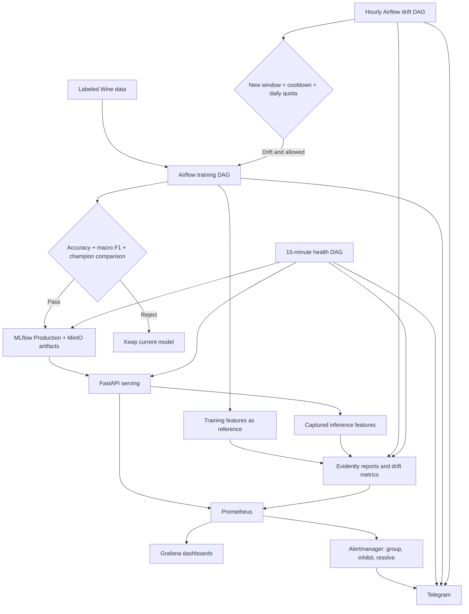

# Wine MLOps: Automated Monitoring and Guarded Retraining

[](https://github.com/hiepdqflame/ml-monitoring/actions/workflows/ci.yml)

**Author:** Do Quang Hiep - 25MS13293

**Repository:** https://github.com/hiepdqflame/ml-monitoring

A reproducible Docker teaching project: Airflow orchestrates a validated data
pipeline, MLflow tracks and versions models, FastAPI serves predictions, Evidently
measures feature drift, and Prometheus/Alertmanager/Grafana monitor operations.
Airflow and Alertmanager deliver optional Telegram notifications.

The dataset is **sklearn Wine cultivar classification**: 178 labeled rows,
13 features, three classes. `wine_quality_model` is a historical registry name;
the prediction is a cultivar class, not a wine quality score.

[Current evidence](screenshots/automation/README.md) ·
[Verification record](docs/automation-verification.md) · [Demo runbook](docs/demo-runbook.md)

## Architecture



## Quick start

Requirements: Git, Docker Desktop/Engine with Compose v2 and internet access for
initial image/dependency downloads. Allocate about 6-8 GB RAM to Docker. Tested
locally on macOS ARM64; CI exercises Docker builds on Linux AMD64.

```bash
git clone https://github.com/hiepdqflame/ml-monitoring.git
cd ml-monitoring
cp .env.example .env       # Fresh clone only; preserve an existing configured .env.
docker compose up -d --build
docker compose ps
bash scripts/test_dashboard.sh
bash scripts/demo.sh --expect-auto-retrain
```

First build takes several minutes. `minio-init`, `airflow-init` and
`alertmanager-init` are one-shot jobs: `Exited (0)` is expected. The prediction API
is alive before a model exists but not ready for predictions; the demo first
trains and deploys a model. A scheduled health check can report that initial
not-ready state correctly. Telegram is disabled by default; no bot is required.

All published ports bind to localhost and coexist with the other tutorials:

- Airflow: http://localhost:18080 - `admin / admin`
- MLflow: http://localhost:15000
- API Swagger: http://localhost:18010/docs
- Evidently: http://localhost:18011/reports
- Grafana: http://localhost:13001 - `admin / admin`
- Prometheus: http://localhost:19091
- Alertmanager: http://localhost:19093
- MinIO console: http://localhost:19001 - `minio / minio123`

Change host ports with the documented variables in `.env.example`. Internal
container URLs use Compose service names. These credentials are local teaching
defaults; the stack is not configured as a public production deployment.

## Airflow behavior

- **`service_health_check`** runs every 15 minutes (`*/15 * * * *`, UTC). It checks
  API model readiness, MLflow and Evidently. DOWN and RECOVERED transitions send
  Telegram; unchanged failures remind at most hourly. An unhealthy service makes
  the DAG fail even if its notification succeeds.
- **`wine_drift_check`** runs hourly (`@hourly`, UTC). It requires reference data,
  at least 30 samples, at least 30 new observations since the last analysis, and
  a latest observation no older than two hours. Missing, stale or unchanged data
  produces an explained no-op, not a fake analysis or a retrain loop.
- **`wine_mlflow_pipeline`** has no independent schedule. Run it manually or let
  the drift DAG trigger it after the persistent policy checks pass.

All DAGs disable catchup and allow one active run each. UI Trigger and the CLI
remain available; you do not need to wait an hour to demonstrate the workflow.

```bash
docker compose exec airflow-scheduler python scripts/trigger_and_wait.py wine_mlflow_pipeline
docker compose exec airflow-scheduler python scripts/trigger_and_wait.py wine_drift_check
docker compose exec airflow-scheduler python scripts/trigger_and_wait.py service_health_check
```

The CLI enables the requested DAG before triggering. For manual-only mode, set
`MONITOR_SCHEDULES_ENABLED=false` and `AUTO_RETRAIN_ENABLED=false` in `.env`, then:

```bash
docker compose up -d --force-recreate airflow-webserver airflow-scheduler
```

## Retraining controls and model lifecycle

1. Ingest and validate schema, finite values, labels and duplicate rows; record a
   SHA-256 dataset fingerprint and a reproducible stratified 142/36 split.
2. Train RandomForest on training rows only; log parameters, model signature,
   dataset artifacts, metrics and Airflow/drift provenance to MLflow.
3. Require accuracy and macro F1 >= 0.90 and no regression against the current
   Production model on the same holdout. Rejection is a valid green DAG outcome;
   it keeps the model and reference unchanged.
4. Promote and reload only after passing. A reload failure attempts to restore
   the previous Production version. Publish only training features as reference.
5. Report PROMOTED / REJECTED / FAILED to Telegram and preserve upstream failures.

Automatic attempts have a **6-hour cooldown**, **3 attempts per UTC day** and a
feature-window fingerprint that prevents repeating the same request. SQLite
transactions persist the policy in `pipeline_data`; deterministic Airflow child
run IDs make retries idempotent. Pending analysis/dispatch can be resumed after
interruption while the data is still eligible. A paused/missing training DAG is
reported as suppressed instead of claiming a successful queued deployment.

`AUTO_RETRAIN_ENABLED=false` is the automatic-retrain kill switch. Cooldown/quota
are configurable through `RETRAIN_COOLDOWN_SECONDS` and `RETRAIN_DAILY_LIMIT`;
manual training remains possible. Failures consume an automatic attempt to bound
repeated work. Inspect failed child tasks before clearing/retrying them.

**What retraining means here:** inference features have no ground-truth labels.
Automatic training deliberately reuses the labeled built-in Wine dataset to
illustrate orchestration, registration and deployment. It does not learn from
unlabeled traffic and does not prove that drift is resolved. Real adaptation needs
new verified labels and an independent evaluation set. Perfect scores on this
small reused holdout are not a production-accuracy claim.

## Telegram and operational alerts

Create a bot through Telegram's BotFather, then open your bot and send `/start`.
Configure credentials privately from the project root:

```bash
python3 scripts/configure_telegram.py
# Rebuild if code changed, then regenerate private Alertmanager config.
docker compose up -d --build --force-recreate alertmanager-init airflow-webserver airflow-scheduler
docker compose up -d --force-recreate alertmanager
```

The helper prompts for token privately, discovers your chat and sends a test.
It writes only local `.env`. Never paste the token into README, screenshots or Git.
Alertmanager's token and generated config live in a private Docker volume; they
are regenerated at initialization and never printed by the renderer.

Airflow reports workflow decisions and service-readiness transitions. Alertmanager
reports sustained metric alerts, groups notifications, inhibits secondary API
alerts while APIDown is active, repeats after four hours and sends resolutions.
APIDown/EvidentlyServiceDown require one minute; DataDriftDetected requires two.
A health transition and a sustained Prometheus alert describe different checks.
AlertmanagerDown is visible in Prometheus; Alertmanager cannot deliver an alert
about itself while it is unavailable.

Telegram delivery failures fail the explicit Airflow notification task, so check
upstream deployment status before retrying. Messages are not exactly-once.
Localhost links in messages are reachable on the Docker host, not a remote phone.

## Tests and CI

```bash
docker compose config --quiet
docker compose exec airflow-scheduler python -m pytest /opt/airflow/tests -q
docker compose exec airflow-scheduler airflow dags list-import-errors
docker compose exec prometheus promtool check config /etc/prometheus/prometheus.yml
docker compose exec alertmanager amtool check-config /etc/alertmanager/private/alertmanager.yml
```

The Airflow suite skips the separate FastAPI serving module. Run it separately:

```bash
docker run --rm --entrypoint sh -e PYTHONPATH=/workspace \
  -v "$PWD:/workspace:ro" -w /workspace ml-monitoring-api \
  -c 'pip install --quiet pytest==8.3.5 httpx==0.25.2 && python -m pytest tests/test_serving.py -q -p no:cacheprovider'
```

GitHub Actions has three jobs: **pipeline**, **serving**, **monitoring-config**.
They do not need Telegram secrets. Live demo assertions verify the real containers,
registry, quality gate and child DAG; unit tests exercise failure and guard cases.

## Persistence and limits

Models/artifacts, Airflow metadata/logs, reference data, reports, alert state and
policy state use Docker volumes. Captured inference rows are an in-memory window
of at most 10,000 rows and reset when Evidently restarts. Prometheus keeps seven
days of metrics. Reports and pipeline artifacts have no automatic retention job.
The SQLite policy assumes this single-host LocalExecutor deployment; a multi-host
production system needs a shared transactional store and deployment locking.

```bash
docker compose stop     # Stop this project; keep data.
docker compose start   # Resume existing containers.
```

## Reference projects and differences

This teaching project builds on the monitoring exercises and was compared with:

- [thaycacac/ddm501 tutorial07](https://github.com/thaycacac/ddm501/tree/b13ae9ce1e24a8c34916a2758c52f31c4618d0cf/tutorial07): three-DAG monitoring/retrain pattern and Alertmanager notifications.
- [longbeebee/mlops-bonus-assignment-2](https://github.com/longbeebee/mlops-bonus-assignment-2/tree/55f243cbf9016fcc1c1822dc41eca20b57126a49): staged data/training/registration workflow and Docker Airflow integration.

This version adds persistent dispatch recovery, deduplication, cooldown/quota,
champion comparison, attempted rollback, training-only reference data, honest
unlabeled-drift limitations, optional private Telegram configuration, automated
assertions and reproducible evidence. It uses drift-triggered training rather than
unconditionally training the same static dataset every day.
