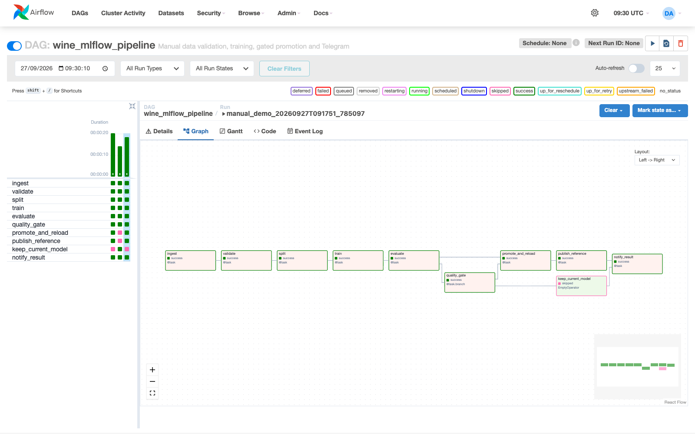
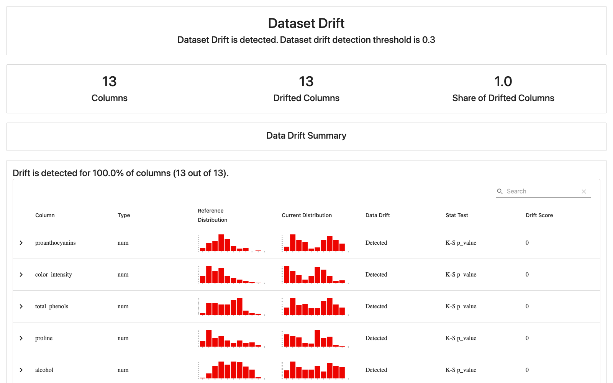

# Live demonstration evidence

Captured on 2026-09-27 from the project's running Docker Compose services.
The 14 browser screenshots show actual application pages. The Telegram screenshot
was saved by the project owner from the real bot conversation. No UI or metric
values were fabricated. Browser images were visually checked before publication.

## Training, quality gate and serving

- [Airflow login](airflow_login.png): local Airflow login page.
- [DAG list](airflow_dags_list.png): both DAGs have `Schedule: None`.
- [Training grid](airflow_model_training_grid.png): successful runs and the skipped
  branch for each quality-gate decision.
- [Training graph](airflow_model_training_graph.png): successful end-to-end run
  `manual_demo_20260927T091751_785097`, including promotion, reference publication
  and notification.
- [Rejected candidate](airflow_model_rejected_run.png): run
  `manual_demo_20260927T085855_311207` kept the current Production model. A green
  DAG is correct here: rejection is a valid business outcome, not a task failure.
- [MLflow registry](mlflow_model_registry.png): registered `wine_quality_model`.
- [MLflow versions](mlflow_model_versions.png): version 2 is Production and
  version 1 is Archived after the later promotion.

## Drift and operational monitoring

- [Drift DAG](airflow_drift_monitoring_graph.png): analysis and Telegram tasks
  succeeded in `manual_demo_20260927T091829_501469`.
- [Historical failure](airflow_drift_failed_run.png): run
  `manual_demo_20260927T085627_039000` intentionally ran before reference data
  existed. The DAG remained failed through finalization. This is failure-path
  evidence, not the current system state; Telegram was disabled for that run.
- [Evidently report](evidently_drift_report.png): report
  `drift_report_20260927_091831.html`, with drift in 13 of 13 features after the
  shifted-data simulation. This measures feature drift, not prediction accuracy.
- [Prometheus targets](prometheus_targets.png): API, Evidently and Prometheus UP.
- [Prometheus alert](prometheus_alerts_firing.png): `DataDriftDetected` FIRING.
  Other alerts can appear pending while this manual demo is idle.
- [Grafana model dashboard](grafana_ml_monitoring.png): historical traffic window
  08:58-09:08 UTC (15:58-16:08 local time), when simulation used model version 1.
  This predates the version 2 promotion. The Error Rate panel displays `No data`
  because no matching 5xx series exists; it is not a measured zero-error guarantee.
- [Grafana drift dashboard](grafana_drift_monitoring.png): drift status, count,
  share and feature-level metrics from Evidently via Prometheus.

## Telegram delivery

- [Actual Telegram messages](telegram-alerts-01.png): setup test, successful
  promotion and detected-drift notifications. The two DAG run IDs match the
  successful training and drift graphs above. One screenshot contains both
  notifications; bot credentials are not included.

## Scope and reproduction

Follow the [project README](../README.md) to start services, train, simulate
traffic and trigger drift analysis. A new installation creates its own run IDs,
model versions and timestamps. Historical local databases and browser sessions
are not committed. See [verification details](../docs/verification.md) for tests
and the limits of the small Wine holdout evaluation.

This project uses Prometheus alert rules and Telegram tasks in Airflow. It does
not include Alertmanager or a separate service-health DAG, so those screenshots
are not claimed. Drift does not automatically trigger retraining; both DAGs
remain manual-only.
